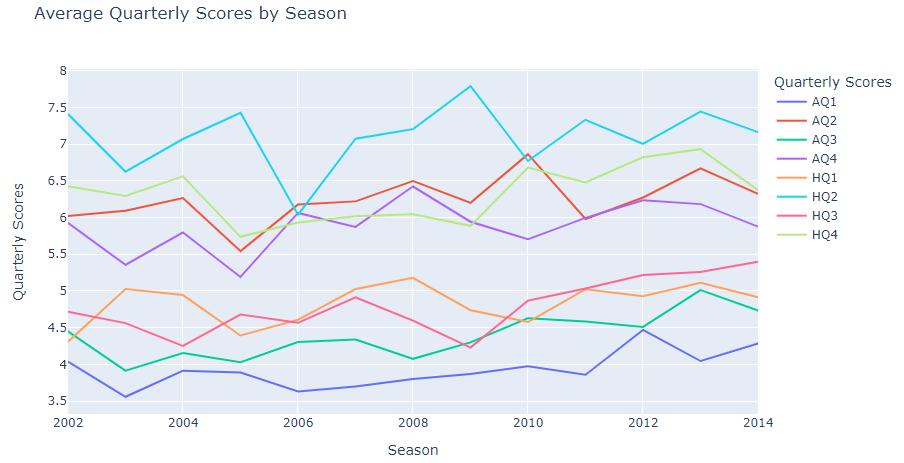

# NFL Pandas on Spark

Illustrate the ease of parallelization with Spark and use MapReduce algorithm to analyze the NFL data.

[Project report](https://htmlpreview.github.io/?https://raw.githubusercontent.com/chsueh2/NFL_pandas-on-Spark/main/NFL.html) 

Key features:

- PySpark
- Map Reduce
- Exploratory data analysis (EDA)
- Time Series Plot
- Pivot Table

Modules used:

- `pyspark`: Python API for Apache Spark
- `numpy`: Python library used for working with arrays
- `pandas`: data manipulation and analysis. In particular, it offers data structures and operations for manipulating numerical tables and time series.
- `matplotlib.pyplot`: plotting library for creating static, animated, and interactive visualizations
- `plotly`:  interactive, open-source, and browser-based graphing library

## Project Report

[Project report](https://htmlpreview.github.io/?https://raw.githubusercontent.com/chsueh2/NFL_pandas-on-Spark/main/NFL.html) ([Jupyter Notebook](./NFL.ipynb))

The analysis results with theoretical backgrounds are included.

Chien-Lan Hsueh (chienlan.hsueh at gmail.com)

## Overview and Project Goal

To illustrate the ease of parallelization with Spark, we can now update an earlier MapReduce algorithm to run on Spark with far fewer steps required. Previously, we had to read in the large scores dataset, subset based on the value of season, then reread these datasets as an iterable list for the map and reduce functions. Now, we can simply use a pandas on spark dataframe to iterate over the values of seasons and parallelize our earlier computations.

## Workflow

1. Preparation
   - Load module
   - Set up configuration to run Spark
   - define aggregation function to work on data (pyspark.pandas.DataFrame)
   - Read in NFL data (with a quick inspection)
2. Statistics Summaries of Aggregated Data

